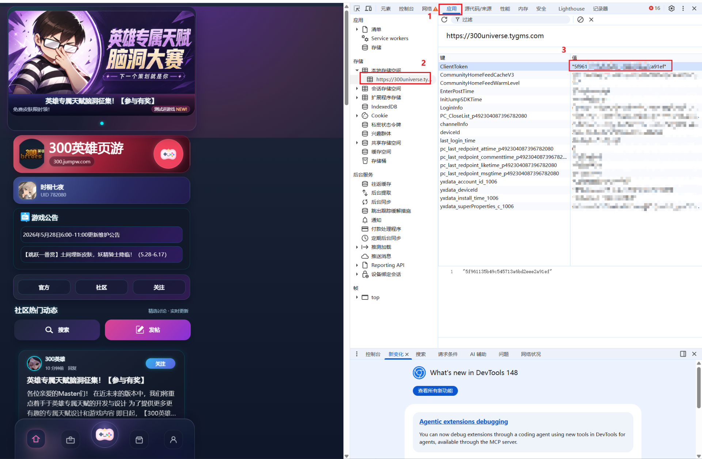

# 300宇宙自动签到

一个用于自动完成300宇宙每日任务的Python工具。

## 🚀 快速开始

### 1. 安装依赖

```bash
pip install -r requirements.txt
```

### 2. 配置Token

编辑 `config.yaml` 文件：

```yaml
token: 你的token在这里
```

> **如何获取Token？** 见下方[获取Token](#-获取token)部分

### 3. 执行任务

```bash
python main.py
```

## 📋 功能列表

- Token验证
- 每日签到
- 点赞/取消点赞
- 评论帖子
- 发布/删除帖子
- 浏览帖子
- 关注/取消关注用户
- 查询战绩和历史战绩
- 批量领取任务奖励

## 🔑 获取Token

### 方法1: 手机抓包

使用HttpCanary等抓包工具（可能需要root权限）：

1. 打开HttpCanary，选择目标应用为"宅基地"
2. 开始抓包后打开宅基地APP
3. 执行任意操作（如点赞）
4. 在抓包记录中找到请求，查看token字段


### 方法2: PC浏览器抓包（备选）

⚠️ 注意：会与手机端互相顶号

1. 访问300宇宙 [https://300universe.tygms.com/](https://300universe.tygms.com/) 并登录
2. 按F12打开开发者工具
3. 依次点击 "应用" → "本地存储空间"，找到 `ClientToken`，复制value值（不含引号）

   

## ⚙️ 配置说明

`config.yaml` 配置项：

```yaml
# ==================== 账号配置 ====================
accounts:
  - name: "账号1"              # 账号备注名称
    token: "你的token"
  
  # 添加更多账号（可选）
  # - name: "账号2"
  #   token: "第二个账号的token"

# ==================== 全局配置 ====================
api_base_url: "https://300zjd.tygms.cn/"  # API地址
default_post_id: 8403            # 默认操作的帖子ID
default_follow_id: "p492..."     # 默认关注的用户ID
task_ids: [1,2,3,4,5,6,7,8,9]   # 要领取的任务ID列表
request_delay: 1.0               # 请求间隔(秒)
account_delay: 5.0               # 账号间延迟(秒)
timeout: 30                      # 请求超时(秒)
```

## ⏰ 定时执行

### Linux/Mac (Crontab)

```bash
# 每小时执行一次
0 * * * * cd /path/to/sb-universe && python main.py >> logs/cron.log 2>&1
```

### Windows 任务计划程序

1. 打开"任务计划程序"
2. 创建基本任务，设置触发器（如每小时）
3. 操作：启动程序 `python`，参数 `task_runner.py`

### 青龙面板（推荐）

1. 上传项目到青龙面板
2. 创建定时任务
3. 命令：`python task_runner.py`

## 📁 项目结构

```
sb-universe/
├── config.yaml          # 配置文件
├── task_runner.py       # 主程序入口 ⭐
│
├── config_manager.py    # 配置管理模块
├── logger.py           # 日志模块
├── api_client.py       # HTTP客户端模块
├── services.py         # 业务服务模块

├── requirements.txt    # 依赖包列表
└── README.md          # 说明文档
```

## 🏗️ 架构设计

采用分层架构：

```
task_runner.py (表现层 - 任务编排)
    ↓
services.py (业务层 - 5个Service类)
    ↓
api_client.py (数据访问层 - HTTP请求)
    ↓
config_manager.py + logger.py (基础设施层)
```

**核心模块：**

- **config_manager.py**: 配置管理
- **logger.py**: 日志系统
- **api_client.py**: HTTP客户端
- **services.py**: 业务服务（UserService, PostService, SocialService, TaskService, StatsService）
- **task_runner.py**: 任务执行器

## 💡 进阶使用

### 

### 添加新功能

1. 在 `services.py` 中添加Service方法
2. 在 `task_runner.py` 中调用
3. 如需新配置，在 `config.yaml` 和 `config_manager.py` 中添加

详见代码注释和示例。

## 📝 更新日志

### v2.0.0 (2026-05-27)

- ✨ 重构为模块化架构
- ✨ 添加完善的日志系统
- ✨ 统一错误处理机制
- ✨ 优化配置管理
- ✨ 添加类型注解
- ✨ 完善文档

### v1.0.0

- 初始版本，单文件实现

## 📄 许可证

本项目仅供学习交流使用，请勿用于商业用途。
